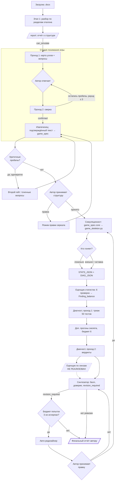

# ФинИгроСкоп: алгоритмический путь и список проблем

Документ описывает, что происходит с игрой от загрузки документа до финального
балла, и честно перечисляет всё, что в этом пути сейчас работает плохо, хрупко
или не работает вовсе.

Составлено по коду на 01.08.2026. Проблемы, помеченные **(проверено)**, я
воспроизвёл; помеченные **(по коду)** — вычитал, но не запускал.

---

## Часть 1. Карта конвейера

---

## Часть 2. Шаг за шагом

Для каждого шага: что на входе, что делает модель, что считает **код** (а не
модель), где останавливается автор и чем шаг может тихо испортить результат.

### Шаг 0. Загрузка и документный анализ

| | |
|---|---|
| Маршруты | `POST /upload` → `/documents/<id>/games` → `/documents/<id>/report/<game>` |
| Модель | не участвует |
| Код | `analysis/stage1.analyze()` — сверка структуры документа с эталоном разделов |
| Выход | `Report`, флаг `can_simulate` на каждую игру |

Документ может содержать несколько игр — дальше весь конвейер параметризован
`game_index`. Без `can_simulate` вход в стадию понимания закрыт на сервере, а не
только скрытием кнопки.

### Шаг 1. Стадия понимания игры («зеркало»)

| | |
|---|---|
| Маршруты | `/mirror/<game>`, `POST .../reply`, `POST .../retry` |
| Вход модели | сырой текст игры по разделам |
| Выход | человекочитаемый пересказ + JSON: `understanding`, `map[]`, `questions[]`, позже `author_clarifications[]`, `still_open[]`, `ready_to_proceed` |
| Хранение | `MirrorSession` (+ `map_json` и `issues_json` отдельными полями) |

Карта узлов двухслойная: 9 узлов ядра проверяются всегда, 7 диагностических —
только если механика присутствует. Четыре статуса: `ok` / `unclear` /
`missing` / `absent`. Различие `missing` («не описано») и `absent` («механики
нет») тянется через весь конвейер: первое — непроверенная дыра, второе —
законный `n/a`.

**Что считает код:** предел раундов (`MAX_ROUNDS = 3`) и принудительное закрытие
сверки на последнем раунде, даже если модель проигнорировала запрет на новые
вопросы. Плюс `validate_pass()` — незаданный вопрос о компонентах, `absent` у
компонентов, потеря `author_clarifications` между раундами, ответ без
машинного блока.

**Остановка автора:** отвечает на вопросы, пока не подтвердит понимание.

### Шаг 2. Извлеченец

| | |
|---|---|
| Маршруты | `/spec/<game>`, `POST .../accept`, `POST .../revise` |
| Вход модели | подтверждённый текст + карта узлов + канонический текст |
| Выход | `game_spec` (закрытый контракт) + сайдкар `diagnostic_meta` |
| Хранение | `GameSpec` |

`game_spec` — контракт, общий с сервисом генерации игр, и расширять его нельзя.
Всё, что нужно только анализу, живёт в `diagnostic_meta`.

**Что считает код:** восстановление `text.full_rules` из канонического текста,
если модель его сократила (копию делает код, а не модель), и три проверки на
бесшумное нарушение контракта.

**Остановка автора:** принимает структуру или отправляет замечание (режим
правки — однократный, новых вопросов не задаёт).

### Шаг 2а. Второй гейт

| | |
|---|---|
| Маршруты | `/gate2/<game>`, `POST .../reply` |
| Повод | извлеченец нашёл `critical: true` пробелы, невидимые на уровне прозы |
| Ограничение | `MAX_GATE2 = 1` |

Единственный агент, которому разрешено обращаться к автору, — пониматель,
поэтому гейт исполняется его промптом (проход 3). На вход обязательно идёт
история проходов 1–2, иначе агент спросит уже отвеченное. После ответа
структура пересобирается заново.

### Шаг 3. Симуляционист

| | |
|---|---|
| Маршруты | `/skeleton/<game>`, `POST .../retry`, `GET .../<game>.py` |
| Вход модели | `game_spec.core` + `diagnostic_meta` + канонический текст |
| Выход | заполненный `game_skeleton.py` + метаданные (границы модели) |
| Хранение | `GameSkeleton` |

Экран показывает **только код**, без статистик — по требованию автора.

**Что считает код:** AST-разбор ответа. Блок «ДВИЖОК» сверяется побайтно,
словарь `reason` закрыт, счётчики `state_signature` на месте, константы-предохранители
не тронуты, импорты — только stdlib.

Ключевые метаданные: `subjective_actions` (что смоделировано случайной
величиной вместо реального решения игроков), `coalition_expressible`,
`metric_responds_immediately`. По ним дальше решают, какие вердикты вообще
имеют право быть жёсткими.

### Шаг 4. Прогон скелета

Два пути, оба ручные:

1. **Локально** (`action=run_local`) — сервис выполняет код в отдельном
   процессе, во временной папке, с таймаутом, без переменных с ключами API.
   Отдаёт и `STATS_JSON`, и `DIAG_JSON`.
2. **Внешне** — автор гоняет файл сам и вставляет **весь вывод консоли**;
   `runner.parse_pasted_output()` сам находит оба блока.

`DIAG_JSON` не является обязательным: его отсутствие — не пустота, а отсутствие
данных, и дальше оно даёт честные `n/a`, а не молчание.

### Шаг 5. Оценщик статистик

| | |
|---|---|
| Маршруты | `/balance/<game>`, `POST .../stats`, `POST .../retry`, `GET .../<game>.json` |
| Вход модели | `game_spec.core`, `STATS_JSON`, три поля сайдкара |
| Выход | `Finding_balance`: 6 проверок с порогами, флаги, два балла, `covered_tests` |

**Что считает код:** разложение «победителя нет» на ничьи и истинную
недостижимость. Это разные болезни с противоположными правками, а в статистике
выглядят одинаково — раньше агент их путал.

`covered_tests` — список тестов методички, которые этот шаг уже закрыл, чтобы
диагност не пересчитывал их и не выносил по тем же числам другой вердикт.

### Шаг 6. Диагност

| | |
|---|---|
| Маршруты | `/diagnost/<game>`, `POST .../execute`, `POST .../retry`, `GET .../<game>.json` |
| Реестр | 50 тестов, 14 категорий (`review/tests_registry.json`) |
| Методичка | отдельным документом в user-сообщении, а не вшита в промпт |

Два прохода с исполнением между ними:

- **Проход 1 (триаж).** Для каждого из 50 тестов — применим / нужен доп. прогон
  / `n/a` с причиной. Вердиктов здесь нет и быть не должно.
- **Между проходами.** Код исполняет заказанные прогоны, дописывая записи в
  `RUN_PLAN` уже готового скелета. К симуляционисту повторно не обращаемся.
- **Проход 2 (вердикты).** `ok` / `warning` / `problem` / `n/a` по каждому тесту.

**Что считает код:** бюджет доп. прогонов (`BUDGET_LIMIT = 6`) и их приоритет.
Обрезанные бюджетом прогоны подаются на проход 2 явно — их тесты обязаны
получить `n/a: budget_exceeded`, а не исчезнуть.

Пять причин `n/a` не равнозначны: `mechanic_absent` значит «проверять нечего»,
остальные четыре — «не измерено». Это различие определяет доверие к финальному
баллу.

### Шаг 7. Оценщик по линзам — **не реализован**

Должен давать качественные баллы по 8 из 9 категорий синтеза. Пока его нет,
синтезатор помечает эти категории `N/A`, исключает из обеих сумм формулы и
понижает доверие до `low`.

### Шаг 8. Синтезатор

| | |
|---|---|
| Маршруты | `/synthesis/<game>`, `POST .../retry`, `GET .../<game>.json` |
| Вход модели | линзы (если есть), `Finding_balance`, `Findings_diagnost`, `STATS_JSON`, метаданные симуляциониста, отложенное авто-редизайнером |
| Выход | балл, `score_confidence`, `revision_required`, приоритеты, `report_md` |

**Что считает код (и потом сверяет ответ модели):**

- балл: Σ(балл × вес) ÷ Σ(весов) по 9 категориям с весами 1.5…0.75;
- стоимость находок: critical −3 (и потолок 5 на категорию), major −2,
  minor −0.5; мягкая находка и частично-конфигурационная — вдвое дешевле;
- потолок накопления −5 на категорию, пол — 1;
- доверие: худшее из двух — доля невыполненных тестов среди применимых и доля
  веса неоценённых категорий;
- `revision_required` по трём условиям: балл < 6, незакрытые critical
  диагноста, critical-флаги баланса.

Модель отвечает за суждение и текст отчёта, не за арифметику. Расхождение с
эталоном — замечание валидатора, а не тихая правка.

### Шаг 9. Авто-редизайнер (условный цикл)

| | |
|---|---|
| Маршруты | `/redesign/<game>`, `POST .../propose`, `POST .../decide` |
| Повод | critical-флаг баланса (режим A) **или** `revision_required` синтезатора (режим B) |
| Бюджет | `MAX_ATTEMPTS = 3` принятых правок |

Лестница вмешательства: сначала подстройка числа, потом отключение мёртвого
элемента, и никогда — добавление новой механики. Всё, что требует нового
правила, уходит в рекомендации автору.

Правка **предлагается**, а не применяется. Принятие сбрасывает скелет,
статистику и вердикты диагноста: они относились к прежней структуре.

Когда бюджет исчерпан, а ревизия всё ещё нужна, отчёт всё равно выдаётся — с
пояснением, что осталось незакрытым.

---

## Часть 3. Сквозные принципы

Полезно держать в голове при любой правке — они объясняют, почему код местами
выглядит избыточно недоверчивым.

1. **Арифметику считает код, суждение — модель.** Всё, что является правилом
   (пороги, формулы, бюджеты, счётчики), вынесено из промпта в код. Модель на
   правилах ошибается тихо: сумма «сходится», а число уезжает.
2. **`n/a` ≠ `ok`, `absent` ≠ `missing`.** В отчёте они выглядят одинаково, а
   означают противоположное. Половина валидаторов существует ради этого различия.
3. **Ответ модели не чинится постобработкой.** Нарушение фиксируется как issue
   и, где это уместно, запрашивается повтор.
4. **Изящная деградация.** Недоступный провайдер не роняет конвейер: агент
   возвращает `available=False`, экран показывает причину.
5. **Мягкие числа.** Действия, исход которых определяют сами игроки, симулятор
   моделирует случайной величиной. По таким числам запрещены вердикт «проблема»
   и правки механики — иначе чинится артефакт допущения.
6. **Автор — последняя инстанция.** Ни одна правка не применяется молча,
   финальный отчёт заканчивается дословным дисклеймером.

---

## Часть 4. Проблемы

### 4.1. Блокирующие качество оценки

**П1. Оценщика по линзам нет.** Из девяти категорий оценивается одна —
«Экономика и баланс». Итоговый балл собран по 15 % веса, доверие всегда `low`.
Живой прогон дал 3.75/10, где 8 категорий — `N/A`. Формально честно, но
итоговым выводом о качестве игры такой балл не является. **(проверено)**

**П2. Находки по неоценённым категориям не влияют на балл.** Пока линз нет,
вердикты диагноста по структурной целостности, навыку и замыслу снижать нечего.
Они выводятся отдельным блоком «Найдено, но на балл не повлияло» — но балл их
не отражает. В живом прогоне так выпали 7 находок из 11, включая спираль
смерти и мультиплеер-пасьянс. **(проверено)**

**П3. Диагност: счётчики в `coverage_summary` не сверяются с фактическими
вердиктами.** Валидатор проверяет только, что `ok + warning + problem + n_a`
равно 50. В живом прогоне сводка сказала `ok 24 / warning 7 / problem 6` при
фактических `27 / 5 / 5` — сумма сошлась, числа врали. Эти же числа читает
синтезатор и видит автор. **(проверено, не исправлено)**

**П4. Промпты и валидаторы не проверены на живой модели по большинству
агентов.** Прогонялись вживую только диагност и синтезатор. Правки промпта
зеркала (компоненты) проверены валидатором, но не поведением модели.

### 4.2. Падения и тупики

**П5. Повторное предложение авто-редизайна после отказа падает с 500.**
`redesign_propose` считает номер попытки как «принятых + 1», но отклонённая
попытка остаётся в базе с тем же номером — вторая вставка ловит
`UNIQUE constraint failed: redesign_attempts.document_id, game_index, attempt_number`.
То есть: отклонить правку и попросить другую = ошибка сервера. **(проверено)**

**П6. Отказ от правок не расходует бюджет.** `attempts_used` считает только
принятые правки, поэтому при бесконечных отказах кнопка «Предложить правку»
показывается всегда, а каждый показ — вызов LLM. Верхней границы расходов нет.
**(по коду)**

**П7. Схема БД меняется только через полное пересоздание.** Каталога миграций
нет, `db.create_all()` не добавляет колонки в существующие таблицы. Сейчас это
скрыто тем, что база стирается при каждом запуске; при переходе на постоянное
хранилище любое добавление поля (например, недавние `mirror_sessions.issues_json`)
сломает старую базу молча. **(по коду)**

### 4.3. Архитектурные

**П8. Все вызовы LLM синхронные, внутри обработчика запроса.** Проход диагноста
занимал 126 с и 352 с, синтезатор — 40 с. Всё это время браузер ждёт, а сервер
разработки однопоточный. Нет очереди, нет прогресса, нет отмены. Второй
пользователь в это время ждёт вообще всё.

**П9. Автоперезагрузчик Flask отключён намеренно** (`use_reloader=False`, иначе
перезапуск посреди синхронного LLM-вызова обрывает соединение). Следствие: после
любой правки `.py` сервер нужно перезапускать руками, иначе видишь старый код.
Я на это наступил в этой сессии.

**П10. Хранилище эфемерное, входа нет.** `AUTH_DISABLED = True`, база и загрузки
чистятся при перезапуске, изоляция — по cookie сессии. Любой запуск тестов
(`import app` без `WERKZEUG_RUN_MAIN`) стирает базу работающего сервера, и
открытая вкладка получает 403 на собственные документы. **(проверено дважды)**

**П11. `SECRET_KEY` захардкожен** в `app.py:66` со значением
`finigroskop-dev-secret-change-me`. Для дев-режима терпимо, для чего угодно
ещё — нет.

**П12. Сервис исполняет код, написанный языковой моделью.** Отдельный процесс,
временная папка, таймаут, без ключей API — но не песочница: права те же, что у
запустившего, включая файлы и сеть. Предупреждение на экране есть, изоляции нет.

**П13. Нет учёта стоимости и токенов.** Размер запроса диагноста измерялся
вручную (~171 тыс. знаков на проход). При игре со 150 картами прибавится ещё
~70 тыс. — упрётся в контекст модели, и заметит это только автор по ошибке.

**П14. Сырые ответы модели не сохраняются.** В базу идёт разобранный JSON;
`raw` возвращается из агента, но нигде не хранится. Когда модель ответила
странно, разбираться постфактум не по чему.

### 4.4. Потери данных между шагами

**П15. `MirrorSession.author_answer` хранит только последний ответ.** Ответы
предыдущих раундов живут в `author_clarifications`, которые модель обязана
переносить. Валидатор теперь ловит укорачивание списка, но восстановить
потерянное всё равно нечем — только повтором прохода.

**П16. Второй гейт однократный, и это иногда мало.** Если после круга
авто-редизайна извлеченец найдёт новые критичные пробелы, спросить автора
будет уже нечем: бюджет гейта потрачен на первом заходе.

**П17. Принятая правка сбрасывает скелет, статистику и диагноста, но не
трогает `GameSpec.issues` и состояние гейта.** Замечания к структуре остаются
от прежней версии.

### 4.5. Мёртвый код и рассинхрон

**П18. Старый одноагентный путь остался в репозитории.**
`prompts.build_review_messages()`, `load_master_prompt()`, `load_balance_prompt()`
и промпты `master_analyzer.md` (200+ строк) и `balance_eval.md` не вызываются
ниоткуда. Они описывают прежнюю схему «один агент оценивает всё» и будут
расходиться с реальным конвейером тем сильнее, чем дольше лежат.

**П19. Методичка балансной верификации содержит два дефекта**, задокументированных
при переносе: отсутствовал заголовок «Категория 5» (восстановлен по ссылкам из
промпта оценщика статистик), и список персонно-слепых тестов расходился с
пояснениями (принято 7 тестов, как в тексте методички).

**П20. Пути к тестовым документам захардкожены** под конкретную машину
(`C:\Users\Eugene\Desktop\НСПК\...`) в каждом сквозном тесте.

### 4.6. Мелкое

- **П21.** `stage1.analyze()` вызывается на каждый GET `/report` и `/mirror` —
  документ перечитывается и переразбирается заново.
- **П22.** Прогресс по конвейеру нигде не виден целиком: нет экрана «где я
  сейчас», переходы только по кнопкам «дальше» с соседних страниц.
- **П23.** Ни один экран не показывает, сколько попыток/раундов осталось, кроме
  зеркала, редизайна и синтеза.
- **П24.** `MAX_ROUNDS`, `MAX_GATE2`, `MAX_ATTEMPTS`, `BUDGET_LIMIT` живут в
  четырёх разных местах.

---

## Часть 5. Что я бы чинил в первую очередь

1. **П5** — падение при отказе от правки: одна строка, ломает штатный сценарий.
2. **П3** — врущие счётчики диагноста: дешёвая проверка, а данные идут в балл.
3. **П1** — оценщик по линзам: без него балл остаётся частичным по построению.
4. **П8** — асинхронные вызовы: без этого сервисом не сможет пользоваться
   больше одного человека одновременно.
5. **П18** — снести мёртвый одноагентный путь, пока он не начал вводить в
   заблуждение.
